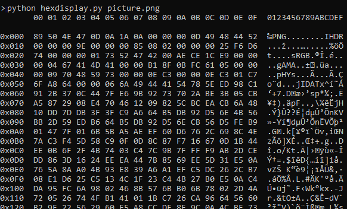

# hexdisplay
## About
*hexdisplay.py* displays binary file content (hex based). The content is displayed as hexadecimal bytes as well as ascii characters.

This project was created as an exercise to demonstrate the programming with Python.

*hexdisplay.py* is written in Python 2.7.

## Usage
```
python hexdisplay.py <filename>
python hexdisplay.py picture.png
```

## Preview

